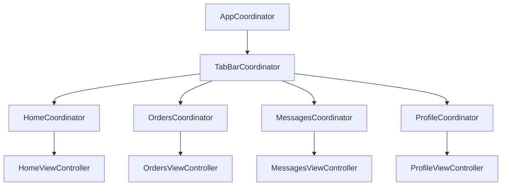

# Coordinator

## The problem the pattern solves

Without a Coordinator, `UIViewController` usually ends up owning two
unrelated things: what to show on screen and where to go next. That
bloats controllers and makes navigation non-reusable — for example, a
"Schedule" screen might be needed both as part of the "Home" tab and as
a modal from "Orders", but if the transition to it is hardcoded inside
`HomeViewController`, you can't reuse it elsewhere without copy-pasting.

A Coordinator takes everything related to "where do we go next" away
from the ViewController, leaving it with only UI and binding to the
ViewModel.

## The protocol

`Sources/GigRoute/Core/Coordinator/Coordinator.swift`

```swift
protocol Coordinator: AnyObject {
    var childCoordinators: [Coordinator] { get set }
    var navigationController: UINavigationController { get }
    func start()
}
```

- **`start()`** — entry point: the coordinator creates the flow's first
  screen and presents it.
- **`childCoordinators`** — the coordinator holds a strong reference to
  any child coordinators it started itself. Without this, a child
  coordinator created as a local variable would be released by ARC right
  after the function returns — and callbacks from its screens would stop
  firing.
- **`navigationController`** — the screen stack this particular
  coordinator manages.

## Hierarchy in the project



### `AppCoordinator`

The root of the tree. Created in `SceneDelegate`, holds the `UIWindow`,
decides which top-level flow to show first (currently always the tab
bar; this is where, say, branching to a login screen would go later if
one gets added).

```swift
func start() {
    let tabBarCoordinator = TabBarCoordinator(dependencies: dependencies)
    addChild(tabBarCoordinator)
    tabBarCoordinator.start()

    window.rootViewController = tabBarCoordinator.tabBarController
    window.makeKeyAndVisible()
}
```

### `TabBarCoordinator`

Creates the `UITabBarController` and one coordinator per tab. Each tab
gets its own `UINavigationController`, so a push inside "Orders" doesn't
touch the "Home" stack: switching tabs back and forth preserves the
position in each stack independently (standard `UITabBarController`
behavior, which we're careful not to break by wrapping each tab in its
own `UINavigationController`).

```swift
private func makeTab(coordinator: Coordinator, title: String, image: UIImage?) -> UINavigationController {
    addChild(coordinator)
    coordinator.start()

    let nav = coordinator.navigationController
    nav.tabBarItem = UITabBarItem(title: title, image: image, selectedImage: nil)
    return nav
}
```

### Module coordinators (`HomeCoordinator` etc.)

Each one is a thin wrapper: creates the `ViewModel` with the dependencies
it needs, creates the `ViewController`, puts it into its own
`navigationController`.

```swift
final class HomeCoordinator: Coordinator {
    func start() {
        let viewModel = HomeViewModel(
            userService: dependencies.userService,
            slotStateStore: dependencies.slotStateStore
        )
        let viewController = HomeViewController(viewModel: viewModel)
        navigationController.setViewControllers([viewController], animated: false)
    }
}
```

When M2/M3/M4 add transitions to detail screens (e.g. tapping a message
in "Messages" opens its details), they get added right here — the
`ViewController` calls a closure/delegate that the `MessagesCoordinator`
listens to, rather than creating the next `ViewController` itself.

## The rule to keep following

A `UIViewController` **never** creates another `UIViewController` and
never calls `navigationController?.pushViewController` directly. A
transition always goes through a callback up to the Coordinator. If you
see `present`/`push` inside a `ViewController`, that's a signal the
logic should move to the coordinator.
