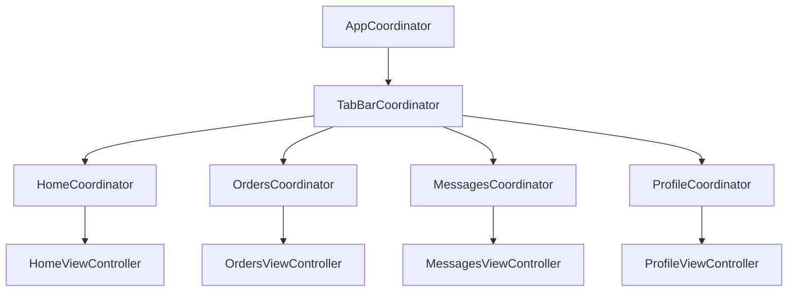

# Coordinator

## Проблема, которую решает паттерн

Без Coordinator `UIViewController` обычно отвечает за две несвязанные
вещи: что показать на экране и куда перейти дальше. Это раздувает
контроллеры и делает навигацию непереиспользуемой — например, экран
"Расписание" может понадобиться и как часть таба "Главная", и как модальный
экран из "Заказов", но если переход к нему захардкожен внутри
`HomeViewController`, использовать его из другого места нельзя без
копипасты.

Coordinator забирает у ViewController всё, что касается "куда идём
дальше", оставляя ему только UI и биндинг к ViewModel.

## Протокол

`Sources/GigRoute/Core/Coordinator/Coordinator.swift`

```swift
protocol Coordinator: AnyObject {
    var childCoordinators: [Coordinator] { get set }
    var navigationController: UINavigationController { get }
    func start()
}
```

- **`start()`** — точка входа: координатор создаёт первый экран флоу и
  показывает его.
- **`childCoordinators`** — координатор держит сильную ссылку на дочерние
  координаторы, которые сам запустил. Без этого дочерний координатор,
  созданный как локальная переменная, был бы освобождён ARC сразу после
  выхода из функции — и колбэки от его экранов перестали бы срабатывать.
- **`navigationController`** — стек экранов, которым управляет именно этот
  координатор.

## Иерархия в проекте



### `AppCoordinator`

Корень дерева. Создаётся в `SceneDelegate`, держит `UIWindow`, решает,
какой флоу показать первым (сейчас — всегда таб-бар; но именно сюда
позже войдёт, например, ветвление на экран логина, если он появится).

```swift
func start() {
    let tabBarCoordinator = TabBarCoordinator(dependencies: dependencies)
    addChild(tabBarCoordinator)
    tabBarCoordinator.start()

    window.rootViewController = tabBarCoordinator.tabBarController
    window.makeKeyAndVisible()
}
```

### `TabBarCoordinator`

Создаёт `UITabBarController` и по одному координатору на таб. У каждого
таба — собственный `UINavigationController`, поэтому пуш экрана внутри
"Заказов" не задевает стек "Главной": переключение таба туда-обратно
сохраняет позицию в каждом стеке независимо (стандартное поведение
`UITabBarController`, которое мы явно не ломаем, оборачивая каждый таб в
свой `UINavigationController`).

```swift
private func makeTab(coordinator: Coordinator, title: String, image: UIImage?) -> UINavigationController {
    addChild(coordinator)
    coordinator.start()

    let nav = coordinator.navigationController
    nav.tabBarItem = UITabBarItem(title: title, image: image, selectedImage: nil)
    return nav
}
```

### Координаторы модулей (`HomeCoordinator` и т.д.)

Каждый — тонкая обёртка: создаёт `ViewModel` с нужными зависимостями,
создаёт `ViewController`, кладёт его в свой `navigationController`.

```swift
final class HomeCoordinator: Coordinator {
    func start() {
        let viewModel = HomeViewModel(
            userService: dependencies.userService,
            slotStateStore: dependencies.slotStateStore
        )
        let viewController = HomeViewController(viewModel: viewModel)
        navigationController.setViewControllers([viewController], animated: false)
    }
}
```

Когда в M2/M3/M4 появятся переходы на detail-экраны (например, тап по
сообщению в "Сообщениях" открывает детали), они добавляются именно сюда —
`ViewController` вызывает замыкание/делегат, который слушает
`MessagesCoordinator`, а не создаёт следующий `ViewController` сам.

## Правило, которое стоит соблюдать дальше

`UIViewController` **никогда** не создаёт другой `UIViewController` и не
вызывает `navigationController?.pushViewController` напрямую. Переход
всегда идёт через колбэк наверх, в Coordinator. Если видите
`present`/`push` внутри `ViewController` — это сигнал, что логика должна
переехать в координатор.
